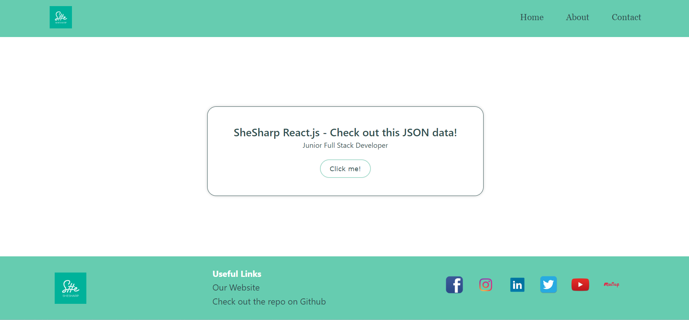
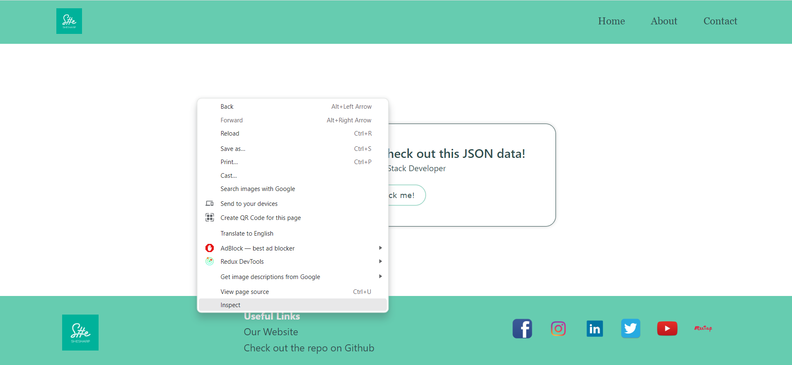
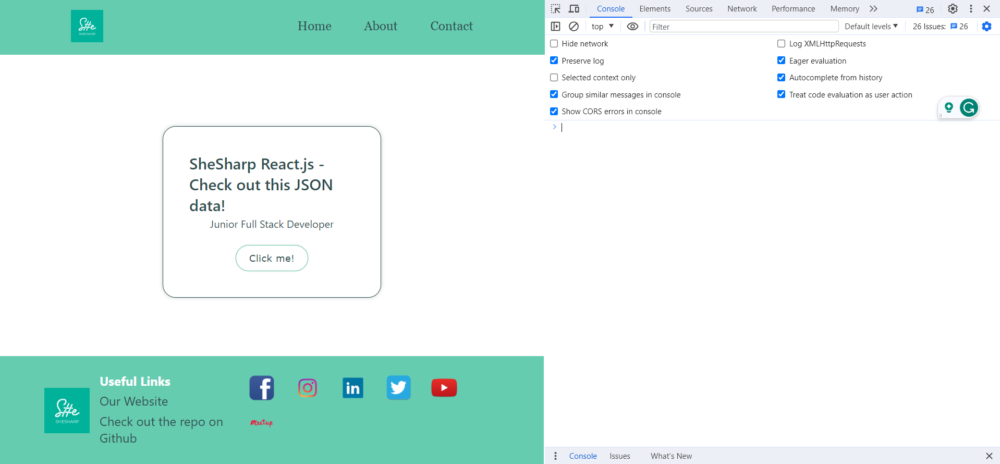

# SheSharp 2023 Hackathon React.js base example / boilerplate

_This boilerplate was bootstrapped with [Create React App](https://github.com/facebook/create-react-app). Some CRA files have been removed and cleaned up to provide a simple starting place._

# hackathon-2023.react-js.base-example

This is a React.js website that fetches and renders data from a static JSON file. It is a slab of marble, waiting for its Michelangelo. There are many winding paths on the journey to building a web application. This simple boiler plate is a great choice for Choose Your Own Adventure enthusiasts.

More practically the code is written in CSS, Javascript, HTML and JSX (a syntax love-child of the former three). It uses the Fetch API to get JSON data and JSX to render that data. It also has some basic features of the React.js framework, such as hooks, state, and a React event handler. There is a single predefined component - a Button. This button triggers the fetch when clicked.

## Table of Contents

- [Prerequisites](#prerequisites)
- [Installation](#installation)
  - [1) Fork the repository](#forking-the-repository)
  - [2) Clone the repository](#cloning-the-repository)
  - [3) Install dependencies](#installing-dependencies)
- [Usage](#usage)
  - [Run the development environment from your terminal](#run-the-development-environment-from-your-terminal)
  - [Make changes and see updates](#make-changes-and-see-updates)
  - [Debugging your project](#Debugging-your-project)
- [How this project works](#how-this-project-works)
  - [React.js](#react.js)
  - [The Fetch API](#the-fetch-api)
  - [Hooks in React](#hooks-in-react)
  - [Implementing routing with Create Browser Router](#implementing-routing-with-create-browser-router)
  - [Deploying your Project on Netlify](#deploying-your-project-to-netlify)
- [Contributing](#contributing)
- [License](#license)

## Prerequisites

Before you can install, use this project and add extra functionalities to it, you need to have the following prerequisites and software installed on your computer:

- **A personal GitHub account**. If you don't already have one, you can sign up for free [here](https://github.com/).
- **Git**: this is a version control system that allows you to manage and track changes to your code. You can download and install Git from the official website [here](https://git-scm.com/downloads).
- **A terminal**: this is the application that allows you to enter commands into your computer. You can use the default terminal on your operating system, or install a third-party terminal such as [iTerm2](https://iterm2.com/) for macOS or [Windows Terminal](https://aka.ms/terminal) for Windows.
- **A code editor**: this is the application that allows you to write and edit code. A [Visual Studio Code](https://code.visualstudio.com/).
- **JavaScript**: this is the programming language used in this project. You don't need to install it separately, as it comes pre-installed with most web browsers.
- **Node.js \***: this is a JavaScript runtime environment that is necessary to run Create React App. It comes with npm, a package manager that will install dependencies. [Node.js here](https://nodejs.org/en)
- **Optional: Google Chrome**: Google Chrome is a web browser with useful developer tools. [Google Chrome Web Browser](https://www.google.com/chrome/)

Once you have all of these prerequisites, you're ready to move on to the installation steps.

## Installation

To install and make this React project your own, you need to fork this repository to your own GitHub account and then clone your forked repository to your local machine.

### 1) Fork the repository

1. Go to the repository page on GitHub: [https://github.com/shesharpnl/hackathon-2023.react-js.base-example](https://github.com/shesharpnl/hackathon-2023.react-js.base-example).

2. Click the "Fork" button in the top right corner of the repository page. This will create a copy of the repository in your own GitHub account.

### 2) Clone the repository

1. Once you have forked the repository, navigate to the forked repository on your GitHub account: [https://github.com/YOUR_USERNAME/hackathon-2023.react-js.base-example](https://github.com/YOUR_USERNAME/hackathon-2023.react-js.base-example). Replace `YOUR_USERNAME` with your GitHub username.

2. Click the "Code" button and copy the HTTPS or SSH link to the repository.

3. Open your terminal and navigate to the directory where you want to store the project. For example: `cd ~/projects`.

4. Type `git clone` followed by the repository link you copied earlier, then press Enter (remember to replace `YOUR_USERNAME` with your GitHub username):

```
git clone https://github.com/YOUR_USERNAME/hackathon-2023.react-js.base-example.git
```

5. Press Enter again to execute the command. This will download the repository to your local machine. If you are cloning the repository using HTTPS, you may be prompted to enter your GitHub username and password.
   If you are cloning the repository using SSH, you will need to set up authentication via SSH. You can find instructions for doing so [here](https://docs.github.com/en/authentication/connecting-to-github-with-ssh). Once you have set up authentication via SSH, you can clone the repository using the SSH URL.

### 3) Install dependencies

Open the root folder of your locally cloned project in your code editor. Start a new terminal and run the command

`npm install`

Nice! You're ready to start coding.

## Usage

This is what the starting boilerplate looks like:



### Run the development environment from your terminal

To verify that the project works by viewing it in your browser, follow these stpes.

1. Open the root folder of your project in your code editor.
2. Open a new terminal in your code editor. Type the command `npm run start`
3. Open [http://localhost:3000](http://localhost:3000) to view it in your browser.
4. The page will reload when you save changes in your project.
5. You may also see any lint errors in the console. The console can be accessed in Google Chrome via the developer tools. Hit the F12 key or right click in the browser window and select inspect.
   
6. Within the developer tools, select "console."

You should be able to see something like this:



### Make changes and see updates

Running the development server locally allows you to make changes and see their effect immediately. This gives instant feedback to you, the developer. You can make changes to any of the files, save them, and the localhost:300 page should automatically update. Nice!!

### Debugging your project

If you are encountering error messages on you console or alerts from react, here are some steps you can take to further understand what is going wrong.

1. Open the root directory of the project in your code editor.
2. Open a new terminal within your code editor. It should also be navigated to the root directory of your project.
3. Type the command ``npm run build`. This attempts to build your project as if it is going to production.
4. If the bundler encounters errors, it will print the first error message it encounters on your code editor terminal.
5. Copy any error codes or messages (the first sentence or two is enough) and search for solutions. ChatGPT can be particularly useful for this.
6. After resolving an error, you can repeat this step until you no longer receive build errors.

## How this project works

### React.js

React.js is a popular JavaScript library used for building user interfaces. It follows a component-based architecture, allowing developers to create reusable UI elements and manage state efficiently. React uses a virtual DOM to optimize rendering performance, making it an ideal choice for creating dynamic and interactive web applications.

One key feature of React is the use of components. This project uses one functional component - a button. You can find this component by navigating from the root directory to `src > components > Button.jsx`.

You can learn more about React from the Docs! [React docs: Quick Start](https://react.dev/learn)

### The Fetch API

The Fetch API is a built-in JavaScript interface that allows you to make HTTP requests and handle responses. It provides a simpler and more flexible alternative to the older XMLHttpRequest object. With the Fetch API, you can send requests to a server, receive data, and handle the response using promises, making it easier to work with data from APIs.

You can learn more about the Fetch API from the Mozilla Developers Network! [MDN - The Fetch API](https://developer.mozilla.org/en-US/docs/Web/API/Fetch_API)

We can see Fetch at work in the `App.jsx` file. We tell the browser to grab the `data.json` file so we can use it in our application.

### Hooks in React.js

This project is already using two React hooks, useEffect, and useState. React Hooks are functions that allow you to add state and lifecycle features to functional components. They provide a way to write reusable and modular code by enabling component-level state management and side effects without the need for class components. OR, to put it more simply, they make React cool and life a bit easier.

_useEffect:_ useEffect is a React Hook that allows you to perform side effects in functional components. It is used to handle tasks like data fetching, subscriptions, or manually changing the DOM, and it runs after every render by default.

_useState:_ useState is a React Hook that enables functional components to have their own local state. It allows you to declare and manage state variables, providing a simple way to update and track changes in component data.

This starting project combines these hooks in the `Home.jsx` file to trigger the data fetch on page load as well as button click. These actions also update the state, in this case, the data, and that state update is reflected in the rendered page.

### Implementing routing with Create Browser Router

Routing allows you to create multiple pages on your website. In our case, we have three main pages: Home, Contact, and About.
The routing functionality is established in the `index.js` file. This is also where you can manage the addition or removal of pages on the website.

To keep things organized, the project is structured with a `routes` folder, which contains the page files, and a `components` folder, containing the components used within those pages.

_Link:_ The project uses this React component as replacement of the `<a>` element.
Here's an example of how you can use it to navigate to the Contact page:
`<Link to={/contact}>Go to contact page!</Link>`

You can learn more about Routing on the docs! [React Router](#https://reactrouter.com/en/main)

## Deploying your project to Netlify

You can submit your hackathon project as a repo, or if you'd like, deploy it with Netlify. Netlify provides detailed instructions on connecting your gitHub account:

[How to Deploy on Netlify](https://www.netlify.com/blog/2016/09/29/a-step-by-step-guide-deploying-on-netlify/)

## Contributing

Before starting, please read our [Contributing Guide](https://github.com/shesharpnl/.github/blob/main/CONTRIBUTING.md) for detailed information and instructions on contributing to this repository.

## License

This project is licensed under the Apache License 2.0 - see the [LICENSE](LICENSE) file for details.
